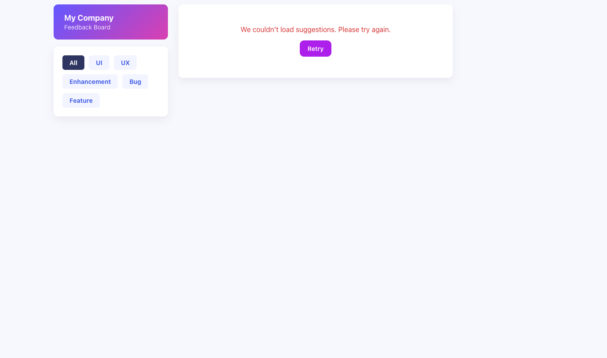

# Product Feedback App

## 📌 Project Description & Purpose
This project is a feedback board where users can browse feature and bug suggestions submitted by others, filter them by category, and submit new suggestions of their own. It's a full-stack app I built for AnnieCannons' "Product Feedback App — AI-Assisted Track" course, pairing a React frontend with an Express/PostgreSQL API I designed and built myself.

## 🚀 Live Site
Check out the app: [https://productfeedbackapp-morgan.netlify.app](https://productfeedbackapp-morgan.netlify.app/)

API: [https://product-feedback-app-a6ds.onrender.com](https://product-feedback-app-a6ds.onrender.com/)

## 🖼️ Screenshots


## ✨ Features
This is what you can do on the app:

* View all submitted suggestions, sorted newest first
* Filter suggestions by category (UI, UX, Enhancement, Bug, Feature)
* Submit a new suggestion with a title, category, and description
* See a friendly empty state when a category has no suggestions yet

## 🛠️ Tech Stack

### Frontend
* **Languages:** JavaScript, CSS
* **Framework:** React 19 + Vite, React Router
* **Deployment:** Netlify

### Server/API
* **Languages:** JavaScript (Node.js)
* **Framework:** Express 5
* **Deployment:** Render

### Database
* **Languages:** SQL (PostgreSQL)
* **Deployment:** Render

## 🔹 API Documentation
These are the API endpoints I built:

1. `GET /get-all-suggestions` — returns all suggestions, newest first
2. `GET /get-suggestions-by-category/:category` — returns suggestions filtered by category (`UI`, `UX`, `Enhancement`, `Bug`, `Feature`)
3. `POST /add-one-suggestion` — creates a new suggestion from a JSON body of `{ title, category, description }`

## 🗄️ Database Schema
Here's the SQL I used to create my tables:

```sql
create table if not exists suggestions (
  id serial primary key,
  title varchar(100) not null check (char_length(title) >= 1),
  category varchar(20) not null check (category in ('UI', 'UX', 'Enhancement', 'Bug', 'Feature')),
  description text not null check (char_length(description) >= 1 and char_length(description) <= 500),
  created_at timestamptz not null default now()
);

create index if not exists suggestions_category_idx on suggestions (category);
create index if not exists suggestions_created_at_idx on suggestions (created_at desc);
```

## 💭 Reflections
**What I learned:** How much of a real audit is verification, not just fixes. During the accessibility pass I ran an axe-core scan and had to judge each flag on its own — some (a missing `<h1>`, a heading level skipped from `h1` to `h3`, a genuinely low-contrast subtitle) were real bugs to fix, but one contrast warning on the "N Suggestions" bar turned out to be a false positive once I checked the actual foreground/background contrast myself. I also learned to treat CORS and error handling as security surfaces, not just plumbing — a wide-open `cors()` call and an unhandled JSON parse error were both quietly leaking more than they should have (the latter was returning raw server file paths in a 500 response).

**What I'm proud of:** Catching that the category filter dropdown was fully wired up in the UI but never actually called `GET /get-suggestions-by-category/:category` — it looked like it worked because the frontend was silently filtering the full list client-side instead. Finding that gap by actually testing the feature, not just reading the code, felt like the real lesson of this project.

**What challenged me:** Working with an AI coding agent (Claude Code) on the assignment's terms — using it to move faster while still being the one who tested every flow, filed the bug reports, and could explain each fix line by line. It meant slowing down on purpose to review generated code and diffs closely, rather than accepting anything that just "looked right" and shipped.

Future ideas for how I'd continue building this project:

1. Let users upvote suggestions and sort the list by vote count
2. Add a status field (e.g. Open / Planned / In Progress / Done) so suggestions can be tracked over time
3. Export suggestions to CSV for easier review outside the app

## 🙌 Credits & Shoutouts
Thanks to AnnieCannons and my instructors for the assignment structure and feedback throughout the milestones! And thanks to Claude Code for pairing with me on implementation as this course's AI-Assisted Track intends.

---

## Running locally

Requires Node and a local or hosted PostgreSQL database.

### 1. Backend

```bash
cd server
npm install
cp .env.example .env
```

Set `DATABASE_URL` in `server/.env` to your Postgres connection string (`PORT` and `FRONTEND_ORIGIN` default to `3001` and `http://localhost:5173`).

```bash
npm run migrate   # create the suggestions table
npm run seed      # optional: add sample data
npm run dev       # starts the API on http://localhost:3001
```

### 2. Frontend

From the project root, in a separate terminal:

```bash
npm install
cp .env.example .env
```

`VITE_API_BASE_URL` defaults to `http://localhost:3001`, matching the backend above.

```bash
npm run dev       # starts the app on http://localhost:5173
```

### Linting

```bash
npm run lint      # oxlint, run from root or server/
```
